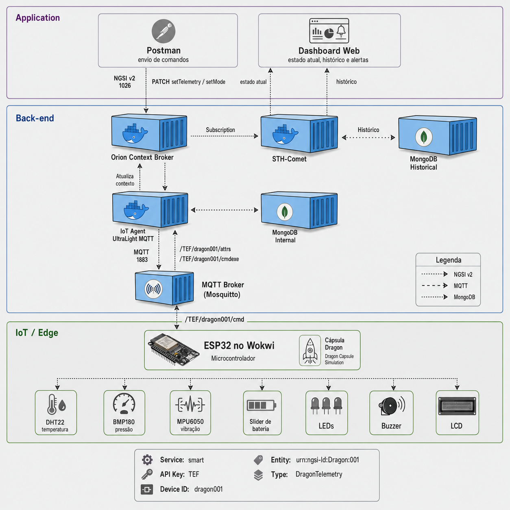
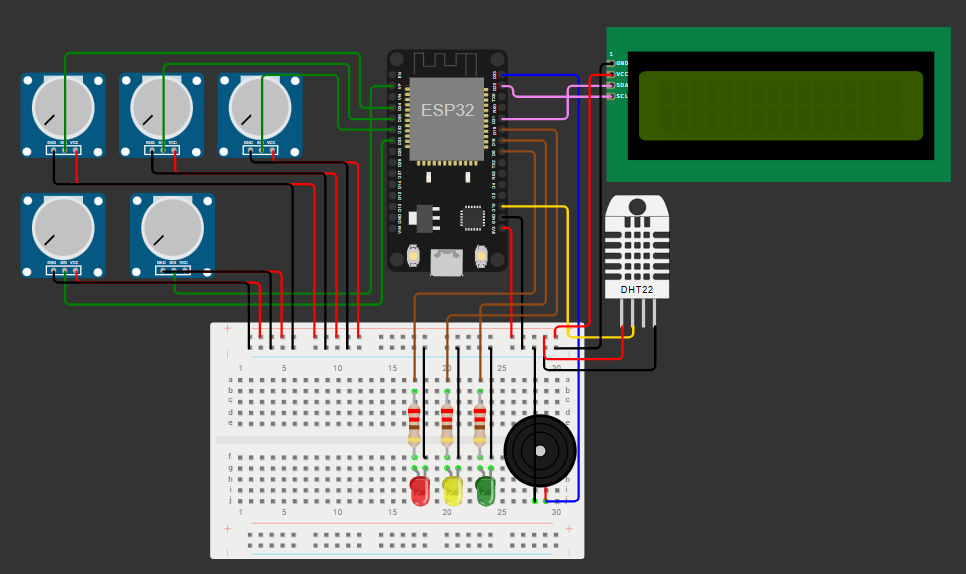

# SolarNav Guard - Dragon Telemetry Edge

Projeto de Edge Computing da Global Solution 2026. O sistema simula uma
capsula Dragon, calcula risco operacional no ESP32 e integra Wokwi, MQTT,
FIWARE, STH-Comet, Postman e um dashboard web.

## Integrantes

| Nome | RM |
| --- | --- |
| Giovanna Oliveira Ferreira Dias | 566647 |
| Marianne Mukai Nishikawa | 568001 |
| Maria Laura Pereira Druzeic | 566634 |
| Pedro Henrique Tavares Viana | 567680 |
| David Ernesto Mogollon Gama | 567855 |

## Diferenciais

- Telemetria local com DHT22, BMP180, MPU6050 e controle de bateria.
- Calculo de risco e alertas continuam ativos mesmo sem rede.
- Controle bidirecional pelo Postman usando comandos FIWARE.
- Modos `LOCAL` e `REMOTE`, com confirmacao de comando no Orion.
- Estado atual no Orion, historico no STH-Comet e dashboard responsivo.

## Arquitetura



Mais detalhes em [docs/arquitetura.md](docs/arquitetura.md).

## Telemetria

| Object ID | Atributo FIWARE | Descricao |
| --- | --- | --- |
| `t` | `temperature` | Temperatura interna em C |
| `p` | `pressure` | Pressao em kPa |
| `b` | `battery` | Bateria em porcentagem |
| `v` | `vibration` | Vibracao em g |
| `r` | `solarRisk` | Risco solar de 0 a 100 |
| `g` | `gpsQuality` | Qualidade GPS de 0 a 100 |
| `risk` | `operationalRisk` | Risco calculado de 0 a 100 |
| `state` | `status` | `NORMAL`, `ATENCAO` ou `CRITICO` |
| `source` | `source` | `LOCAL` ou `REMOTE` |

Payload UltraLight:

```text
t|24.0|p|101.3|b|90|v|0.05|r|20|g|95|risk|4|state|NORMAL|source|LOCAL
```

Os limites e pesos oficiais estao em
[docs/limites-operacionais.md](docs/limites-operacionais.md).

## Subir e provisionar o FIWARE

Suba o stack do
[FIWARE Descomplicado](https://github.com/fabiocabrini/fiware) e execute:

```powershell
.\fiware\healthcheck.ps1 -HostName 34.95.135.39
.\fiware\provision-dragon.ps1 -HostName 34.95.135.39
```

O provisionamento remove configuracoes antigas deste dispositivo, recria
service group, dispositivo, comandos, entidade e deixa uma unica subscription
historica. Falhas encerram o script com erro.

Topicos:

```text
/TEF/dragon001/attrs
/TEF/dragon001/cmd
/TEF/dragon001/cmdexe
```

## Usar o Postman

Importe:

```text
postman/SolarNav-Guard-FIWARE.postman_collection.json
```

Fluxo recomendado:

1. Execute `1 - Healthcheck`.
2. Rode o script idempotente de provisionamento.
3. Inicie a simulacao Wokwi.
4. Envie um preset em `3 - Comandos para o Wokwi`.
5. Consulte `Resultado do ultimo comando`.

`setTelemetry` aceita qualquer subconjunto de:

```text
temperature, pressure, battery, vibration, solarRisk, gpsQuality
```

Ao receber o primeiro comando, o ESP32 copia a leitura local e altera apenas
os campos enviados. Um campo invalido rejeita o comando inteiro. O risco e o
status nunca sao definidos pelo Postman; continuam calculados no edge.

`Voltar ao modo LOCAL` devolve o controle aos sensores.

## Rodar o dashboard

```powershell
cd dashboard
$env:FIWARE_HOST="34.95.135.39"
npm start
```

Abra `http://localhost:3000`.

O dashboard usa `TimeInstant`, marca dados com mais de 15 segundos como
antigos, mostra a origem e o resultado do ultimo comando.

Testes:

```powershell
cd dashboard
npm test
```

O registro da validacao executada esta em
[docs/teste-integrado-2026-06-09.md](docs/teste-integrado-2026-06-09.md).

## Usar no Wokwi

Projeto publico atual:

https://wokwi.com/projects/466306185057884161



Atualize o projeto publico com:

- `wokwi/sketch.ino`
- `wokwi/diagram.json`
- `wokwi/libraries.txt`

O broker configurado e `34.95.135.39:1883`. O Wokwi online nao acessa
`localhost`, portanto o Mosquitto precisa estar publicamente acessivel.

Controles locais:

- DHT22: temperatura.
- BMP180: pressao.
- MPU6050: vibracao derivada da aceleracao.
- Slider: bateria.
- Risco solar local: `20`.
- Qualidade GPS local: `95`.

## Seguranca e evolucao

A VM usa MQTT e APIs FIWARE publicas sem TLS ou autenticacao. Isso e aceitavel
somente para demonstracao academica. Nao envie dados sensiveis.

O IoT Agent UltraLight esta arquivado e o STH-Comet e uma tecnologia legada.
Eles foram mantidos por compatibilidade com a stack exigida. Uma evolucao de
producao deve avaliar IoT Agent JSON, NGSI-LD, TLS e controle de acesso.

Veja [docs/avaliacao-critica.md](docs/avaliacao-critica.md).

## Links da entrega

- GitHub publico: https://github.com/pedrot-git/GS-EdgeComputing
- Wokwi publico: https://wokwi.com/projects/466306185057884161

## Referencias

- [FIWARE Descomplicado](https://github.com/fabiocabrini/fiware)
- [IoT Agent UltraLight MQTT](https://fiware-iotagent-ul.readthedocs.io/en/latest/usermanual.html)
- [Orion Context Broker](https://fiware-orion.readthedocs.io/)
- [Wokwi Supported Hardware](https://docs.wokwi.com/getting-started/supported-hardware)
