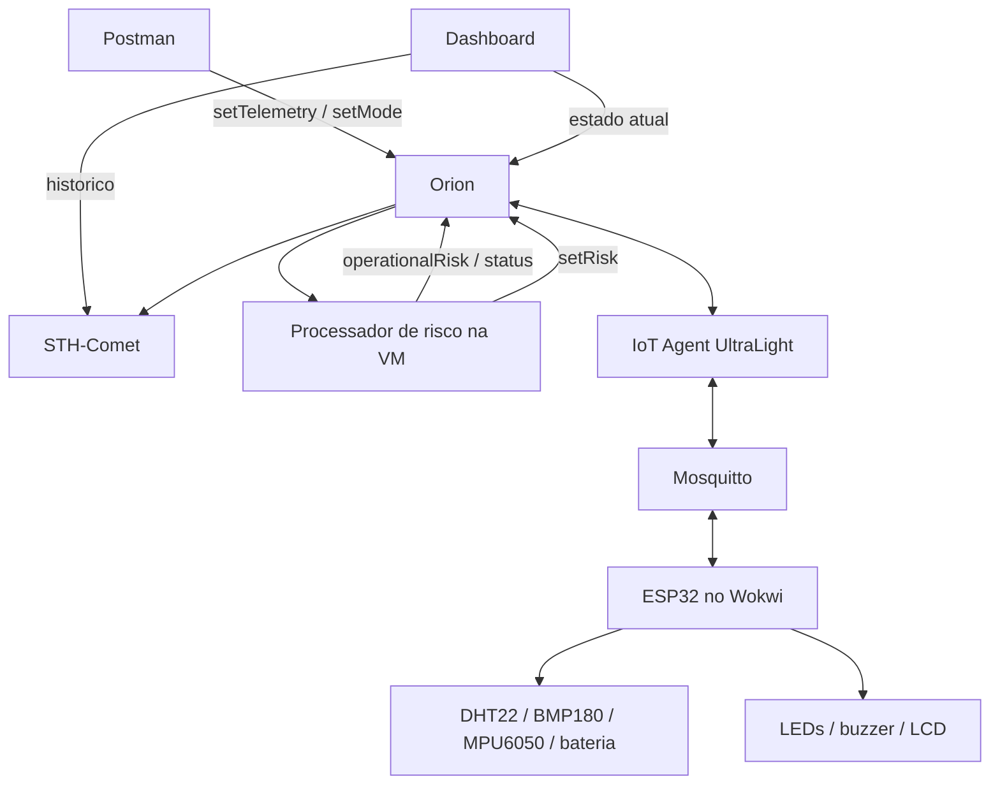

# Arquitetura - SolarNav Guard Dragon Telemetry

## Responsabilidades

- **ESP32/Wokwi:** le sensores, escolhe modo LOCAL/REMOTE, valida comandos e
  aciona LEDs, buzzer e LCD com o ultimo `setRisk` recebido.
- **IoT Agent MQTT:** converte UltraLight em NGSI-v2 e encaminha comandos.
- **Orion:** concentra telemetria atual e estado dos comandos.
- **Processador de risco:** observa novas leituras, calcula risco/status,
  atualiza o Orion e envia `setRisk` ao ESP32.
- **STH-Comet:** armazena o historico dos atributos de telemetria.
- **Dashboard:** apresenta estado, origem, frescor, historico e alertas.
- **Postman:** envia comandos e consulta resultados sem escrever risco/status.

## Identificadores

- Service: `smart`
- Service path: `/`
- API key: `TEF`
- Device ID: `dragon001`
- Entity ID: `urn:ngsi-ld:Dragon:001`
- Entity type: `DragonTelemetry`

## Ligacoes I2C

- BMP180 e LCD 16x2: SDA `GPIO 21`, SCL `GPIO 22`.
- MPU6050: SDA `GPIO 25`, SCL `GPIO 26`.

BMP180 e LCD compartilham o barramento principal porque possuem enderecos I2C
diferentes. O MPU6050 usa sozinho o segundo barramento do ESP32.

## Modos

Em `LOCAL`, temperatura, pressao, vibracao e bateria vem dos componentes
Wokwi. Risco solar vale `20` e GPS vale `95`.

Em `REMOTE`, `setTelemetry` copia a ultima leitura local e aplica somente os
campos recebidos. A validacao e atomica: um campo invalido rejeita tudo.
`setMode=LOCAL` devolve o controle aos sensores.

## Comandos

| Comando | Valor | Efeito |
| --- | --- | --- |
| `setTelemetry` | Objeto parcial | Ativa REMOTE e altera os campos enviados |
| `setMode` | `LOCAL` | Retorna aos sensores |
| `setRisk` | `risk` e `status` | Atualiza apenas LCD, LEDs e buzzer |

O IoT Agent publica em `/TEF/dragon001/cmd`. O ESP32 confirma em
`/TEF/dragon001/cmdexe`, gerando `<comando>_status` e `<comando>_info`.

`setRisk` e um comando interno do processador da VM. O usuario opera apenas
`setTelemetry` e `setMode`.

## Falhas

- Sem Wi-Fi/MQTT, o ESP32 continua lendo sensores e mantem o ultimo risco
  recebido, mas nao recebe novos calculos.
- Sem o processador da VM, sensores continuam chegando ao Orion, mas
  `operationalRisk` e `status` deixam de acompanhar as leituras.
- Sem Orion, o dashboard mostra indisponibilidade.
- Com `TimeInstant` mais antigo que 15 segundos, mostra `Dados antigos`.
- Com comando invalido, o ESP32 preserva o estado anterior e responde `ERROR`.
